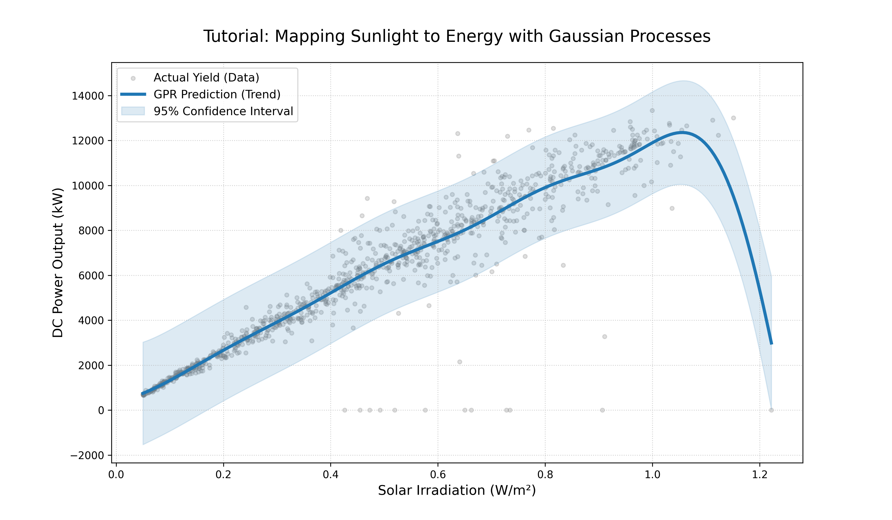

# Uncertainty-Aware Solar Forecasting using Gaussian Process Regression (GPR)


## 📌 Project Overview
This repository contains a comprehensive tutorial on **Gaussian Process Regression (GPR)**. The project demonstrates how to use Bayesian inference to forecast solar power generation while quantifying model uncertainty. 

By fusing weather sensor data with power generation logs, we provide a robust framework for renewable energy prediction, specifically designed for Master's level Machine Learning coursework.

## 🚀 Key Features
- **Technical Depth:** Implementation of optimized RBF and White Kernels via Log-Marginal Likelihood (LML).
- **Data Synergy:** Merging of disparate time-series datasets (Generation + Weather).
- **Visual Teaching:** 95% Confidence Interval visualization for predictive uncertainty.
- **Accessibility:** High-contrast plots and modular, documented code.

## 🛠️ Installation & Setup
To run this tutorial locally, ensure you have Python 3.8+ installed.

1. **Clone the repository:**
   ```bash
   git clone https://github.com/charanlogs/ML-Solar-GPR-Tutorial.git
   cd ML-Solar-GPR-Tutorial
    ```
    
2. **Install dependencies:**
   ```bash
   pip install -r requirements.txt
   ```

3. **Data Source:**
   Download the [Solar Power Generation Data](https://www.kaggle.com/datasets/anikannal/solar-power-generation-data) from Kaggle and place `Plant_1_Generation_Data.csv` and `Plant_1_Weather_Sensor_Data.csv` in the data directory.

## 📊 Results
The model effectively learns the non-linear relationship between irradiation and DC power. Below is the primary output of the GPR model:



## ♿ Accessibility Statement
In compliance with the assignment rubric, this repository emphasizes inclusive design:
- **Visuals:** Plots use high-contrast color schemes (Blue/Gray) and distinct markers for color-blind accessibility.
- **Code:** Every function is commented, and variables are named descriptively for screen-reader clarity.
- **Documentation:** This README provides text-based descriptions of all visual data trends.

## ⚖️ License
This project is licensed under the **MIT License** - see the [LICENSE](LICENSE) file for details. This allows for open-source re-use and academic review.

## 📚 References
- Rasmussen, C. E., & Williams, C. K. I. (2006). *Gaussian Processes for Machine Learning*. MIT Press.
- Pedregosa, F., et al. (2011). *Scikit-learn: Machine Learning in Python*. JMLR.
